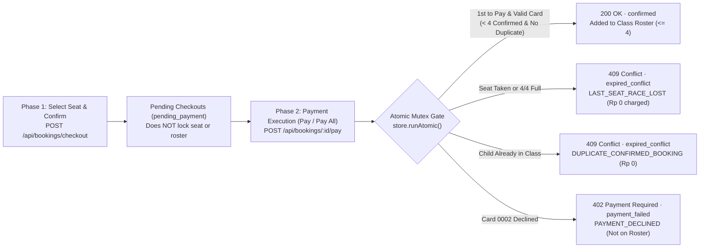

# Ottodot Trial Booking Reliability (`./trial-booking-reliability`)

Full-stack implementation of the **Ottodot Senior Full-Stack Engineer Take-Home Assignment ([`docs/TAKE_HOME_ASSIGNMENT.md`](./docs/TAKE_HOME_ASSIGNMENT.md))**.

- **Live Deployment**: [https://trial-booking-reliability.irfankurniawan.com](https://trial-booking-reliability.irfankurniawan.com)
- **Assignment Specification**: [`docs/TAKE_HOME_ASSIGNMENT.md`](./docs/TAKE_HOME_ASSIGNMENT.md)
- **AI Workflow Reflection**: [`AI_USAGE.md`](./AI_USAGE.md)
- **Tech Stack**: Monorepo (`Turborepo + pnpm workspaces`) · **Backend**: Hono RPC (`@trial-booking/server`) + Zod (`@trial-booking/shared`) · **Frontend**: Nuxt 4 + Nuxt UI v4 + Pinia (`@trial-booking/dashboard`) + Type-Safe RPC Client (`@trial-booking/api-client`).

---

## 1. How to Run the Solution

### Option A: Local Development (`pnpm dev`) — Fastest Setup

Requires **Node.js >= 22** and **pnpm >= 10**.

```bash
# 1. Install dependencies
pnpm install

# 2. Start Backend (http://localhost:24001) and Frontend (http://localhost:24002)
pnpm dev
```

- **App URL**: [http://localhost:24002](http://localhost:24002)
- **API Health**: [http://localhost:24001/api/health](http://localhost:24001/api/health)

```bash
# Run Prettier, ESLint, TypeScript typecheck, and Vitest concurrency test suite
pnpm verify && pnpm test
```

### Option B: Docker Compose (Multi-Stage Build)

```bash
docker compose up --build -d
# App runs at http://localhost:24002 (Stop with: docker compose down)
```

### Option C: Cloudflare Workers (Production Edge)

Deployed as 2 Workers on custom domain `https://trial-booking-reliability.irfankurniawan.com`:

- `trial-booking-dashboard`: `trial-booking-reliability.irfankurniawan.com`
- `trial-booking-server`: `trial-booking-reliability.irfankurniawan.com/api/*`

---

## 2. What Was Built & Engineering Approach

We built **trial class booking only** (capped strictly at `MAX_CLASS_CAPACITY = 4` confirmed students per class) using a **Two-Phase Checkout + Strict FIFO Payment Confirmation Gate**:



### Key Screens & Features

1. **Book Trial (`/`)**:
   - **Manual Selection**: Pick a `Parent`, `Child`, `Trial Class`, and `Seat (1..4)`, then click **`Confirm Seat`** to place the booking into **`Pending Checkouts`** (filtered by the selected class, sorted latest DESC with millisecond timestamps).
   - **Quick Auto-Stage Buttons**: 1-click buttons (`Random Seat`, `Same Taken Seat Race (2x)`, `Duplicate Child (2x)`, `Overbook Class (>4 Cap)`) that automatically stage edge-case combinations into **`Pending Checkouts`** so you can click **`Pay`** or **`Pay All`** to test them immediately.
   - **Pending Checkouts (`Pay`, `Cancel`, `Pay All`, `Cancel All`)**: Choose `Visa •••• 4242 (Pay & Confirm)` or `Card •••• 0002 (Simulate Decline)`. Clicking **`Pay All`** fires concurrent `Promise.all` payment requests and displays per-item millisecond execution telemetry in the top alert banner.
2. **Class Roster (`/roster`)**:
   - Displays each class's verified **`Confirmed Roster` (`<= 4` students)** with confirmation timestamps alongside **`Excluded Attempts (Not on Roster)`** (`pending_payment`, `payment_failed`, `expired_conflict`, `cancelled`) and an **`+ Add Class`** form (`POST /api/classes`).
3. **Booking History (`/history`)**:
   - Server-paginated ledger (`GET /api/bookings`, default `100` rows/page) with status and class filters.

---

## 3. Backend Design & Data Model

### 3.1 Data Model (`packages/shared/src/schemas.ts`)

- **`parents`**: `id`, `name`, `email`, `phone`
- **`students`**: `id`, `parentId`, `name`, `age`, `gradeLevel`
- **`trial_classes`**: `id`, `title`, `subject` (`Math` | `Science`), `gradeRange`, `teacherName`, `scheduledAt`, `durationMinutes`, `priceIdr`, `maxCapacity` (`4`)
- **`bookings`**:
  - `id`, `parentId`, `studentId`, `trialClassId`, `seatNumber` (`1..4`)
  - `status`: `'pending_payment' | 'confirmed' | 'payment_failed' | 'expired_conflict' | 'cancelled'`
  - `conflictReason`: `'LAST_SEAT_RACE_LOST' | 'DUPLICATE_CONFIRMED_BOOKING' | 'CLASS_CAPACITY_EXCEEDED' | 'PAYMENT_DECLINED' | null`
  - `conflictingBookingId`, `version`, `createdAt`, `updatedAt`, `confirmedAt`
- **`payment_attempts`**:
  - `id`, `bookingId`, `amountIdr`, `method`, `status` (`'succeeded' | 'failed' | 'aborted_conflict'`), `errorCode`, `message`, `createdAt`

### 3.2 Key API Endpoints (`apps/server/src/index.ts`)

| Endpoint                        | Responsibility                                                                                                          |
| :------------------------------ | :---------------------------------------------------------------------------------------------------------------------- |
| `GET /api/catalog`              | Returns parents, students, 4-seat class occupancy states, and `pending_payment` checkouts.                              |
| `POST /api/bookings/checkout`   | Creates or refreshes a `pending_payment` checkout intent (`Confirm Seat`).                                              |
| `POST /api/bookings/:id/pay`    | Atomic FIFO payment critical section (`store.runAtomic`) that validates invariants and confirms or rejects the booking. |
| `POST /api/bookings/:id/cancel` | Cancels a `pending_payment` checkout (`status = 'cancelled'`).                                                          |
| `POST /api/classes`             | Creates a new 4-seat trial class (`+ Add Class` on `/roster`).                                                          |
| `GET /api/rosters`              | Returns verified `confirmed` rosters (`<= 4`) and excluded non-roster attempts.                                         |
| `GET /api/bookings`             | Server-paginated booking & payment attempt history (`page`, `limit`, `status`, `trialClassId`).                         |
| `POST /api/reset`               | Resets the in-memory store to the initial seed state (`Reset Data` button).                                             |

### 3.3 How Core Invariants Are Enforced (`apps/server/src/booking-engine.ts`)

1. **Duplicate Confirmed Bookings (`409 DUPLICATE_CONFIRMED_BOOKING`)**:
   - Checked both at checkout creation and inside the atomic payment gate (`processPayment`). If `studentId + trialClassId` already has a `confirmed` row, payment is aborted (`amountIdr = 0`, `status = 'aborted_conflict'`) and the duplicate booking transitions to `expired_conflict`.
2. **Overbooking Beyond 4 Students (`409 CLASS_CAPACITY_EXCEEDED` / `LAST_SEAT_RACE_LOST`)**:
   - Inside `store.runAtomic()`, the engine counts `confirmed` bookings for `trialClassId`. If `confirmedCount >= 4` (or `seatNumber` is already confirmed), the booking is rejected with `409 Conflict` and `Rp 0` charged.
3. **Payment Failure Isolation (`402 PAYMENT_DECLINED`)**:
   - When `Card •••• 0002` is used, a `failed` `PaymentAttempt` is recorded and the booking transitions to `payment_failed`. Because only `status === 'confirmed'` rows populate `confirmedRoster`, failed payments never add a student to the class roster.

### 3.4 Where Checks Belong Across the Stack

| Layer                                 | Responsibility                                                                                                                                                                                                                   |
| :------------------------------------ | :------------------------------------------------------------------------------------------------------------------------------------------------------------------------------------------------------------------------------- |
| **UI (`@trial-booking/dashboard`)**   | Disables confirmed seats, provides Zod form validation, and displays clear `200` / `409` / `402` alerts with millisecond timestamps.                                                                                             |
| **Backend (`@trial-booking/server`)** | Enforces sliding-window rate limiting (`429`), Zod schema validation, atomic mutex serialization (`store.runAtomic`), and `payment_attempts` logging.                                                                            |
| **Database (Production SQL)**         | Enforces `SELECT ... FOR UPDATE` on the `trial_classes` row plus partial unique indexes: `UNIQUE (student_id, trial_class_id) WHERE status = 'confirmed'` and `UNIQUE (trial_class_id, seat_number) WHERE status = 'confirmed'`. |
| **Background Job / Cron**             | Expires abandoned `pending_payment` checkouts older than TTL (e.g., 15m) to `cancelled` and reconciles payment gateway webhooks.                                                                                                 |

---

## 4. Required Technical Scenario: Last-Seat Race

### How It Works

1. **User A (`Arka Rahma`)** selects **Seat #4** (the last remaining seat in `Visual Fractions & Ratios Lab`, which already has `3/4` confirmed students) and moves to `Pending Checkouts` (`status = 'pending_payment'`).
2. **User B (`Dina Santoso`)** also selects **Seat #4** and moves to `Pending Checkouts` (`status = 'pending_payment'`).
3. **User B completes payment first** (`Pay` or `Pay All`) $\rightarrow$ enters `store.runAtomic()` first, verifies `confirmedCount === 3 < 4`, captures `Rp 75.000`, and transitions to **`confirmed` (`4/4` Full)**.
4. **User A then tries to complete payment** $\rightarrow$ enters `store.runAtomic()` second, detects `confirmedCount === 4` (and `Seat #4` is now taken by User B), aborts payment (`Rp 0` charged, `status = 'aborted_conflict'`), transitions User A to **`expired_conflict` (`LAST_SEAT_RACE_LOST`)**, and returns **`HTTP 409 Conflict`**.

### Approach Chosen, Why & Tradeoffs

- **Approach**: **Optimistic Checkout (`pending_payment`) + Strict Atomic FIFO Payment Gate (`store.runAtomic`)**.
- **Why We Chose It**: Hard-locking seats when a parent merely opens checkout allows abandoned carts to block high-intent parents in a small 4-student class. Allowing multiple `pending_payment` checkouts and serializing seat confirmation at the moment of payment (`FIFO by payment execution time`) maximizes class fill rates while guaranteeing **at most 1 student wins the 4th seat** and the runner-up is never charged (`Rp 0`).
- **Tradeoffs Accepted**: A slower shopper (User A) who stays in `Pending Checkouts` while User B pays first receives a `409 Conflict` at payment submission. With a real payment gateway (Stripe/Midtrans), this requires **two-phase manual capture (`capture_method: 'manual'`)** so pre-authorized funds can be voided immediately if the atomic seat confirmation check fails.

---

## 5. Seed Data & Edge Cases (`apps/server/src/seed.ts`)

Click **`Reset Data`** in the top navbar at any time to restore this exact snapshot:

| Trial Class                                              | Seed State                                                                                        | Edge Case to Test                                                                                                                                                                     |
| :------------------------------------------------------- | :------------------------------------------------------------------------------------------------ | :------------------------------------------------------------------------------------------------------------------------------------------------------------------------------------ |
| **Visual Fractions & Ratios Lab** (`cls-math-fractions`) | **`3 / 4 Confirmed`** (`Seat 1, 2, 3` taken; `Seat 4` open + `Arka Rahma` in `Pending Checkouts`) | **Last-Seat Race**: Click **`Same Taken Seat Race (2x)`** (or select `Dina Santoso` on `Seat 4` $\rightarrow$ `Confirm Seat`), then click **`Pay All (2)`**.                          |
| **Planetary Orbits & Gravity Physics** (`cls-sci-orbit`) | **`1 / 4 Confirmed`** (`Dina Santoso` in `Seat 1`) + 1 `payment_failed` (`Nadia Rahma`)           | **Available Seats**, **Duplicate Child (`Duplicate Child (2x)` $\rightarrow$ `Pay All`)**, **Overbooking (`Overbook Class (>4 Cap)` $\rightarrow$ `Pay All`)**, and **Card Decline**. |
| **Algorithmic Puzzles & Game Logic** (`cls-math-logic`)  | **`4 / 4 Confirmed`** (`Full Capacity`)                                                           | **Overbooking Guard**: Attempting to book any seat returns **`409 CLASS_CAPACITY_EXCEEDED`**.                                                                                         |

---

## 6. Time Spent, Assumptions, Scope Cuts & Post-Release Plan

- **Time Spent**: ~3.5 hours (0.5h domain modeling & concurrency design, 1.5h Hono engine + rate limiter + Vitest concurrency suite, 1.0h Nuxt 4 UI & Pending Checkouts flow, 0.5h Docker, Cloudflare Workers & documentation).
- **Assumptions Made**:
  - Duplicate booking prevention is scoped per `(studentId, trialClassId)` so a parent with two children (`Budi Santoso` -> `Dina` and `Raka`) can enroll both siblings in the same trial class if seats are open.
  - Seat selection (`Confirm Seat` / `pending_payment`) does not grant priority; **payment execution order (FIFO at `POST /api/bookings/:id/pay`)** determines who wins a contested seat.
- **What Was Deliberately Cut**:
  - Regular recurring weekly enrollment (explicitly out of scope).
  - External SQL container dependency (used an atomic in-memory store with `store.runAtomic()` mutex serialization and 1-click `POST /api/reset` for instant reviewer setup).
- **What We Would Monitor After Release**:
  1. **`P0` Capacity / Duplicate Invariant Alert**: Any class with `confirmedCount > 4` or duplicate `(student_id, trial_class_id)` confirmed rows (must always be `0`).
  2. **Last-Seat Race Conflict Rate (`409 LAST_SEAT_RACE_LOST`)**: High rates indicate demand exceeding supply and should trigger opening another parallel class section.
  3. **Card Decline Recovery Rate (`402 PAYMENT_DECLINED` $\rightarrow$ `confirmed`)**: Tracks parent retry success after payment failures.
- **What We Would Do Next With More Time**:
  1. Persist state in **PostgreSQL** (using `SELECT ... FOR UPDATE` + partial unique indexes) or **Cloudflare Durable Objects** (one actor per `trialClassId`).
  2. Integrate **Stripe / Midtrans Pre-Auth (`capture_method: 'manual'`)** so charges are captured only after the atomic seat lock succeeds.
  3. Offer an **instant 1-click alternate class slot or waitlist** when a parent loses a last-seat race (`409`).
